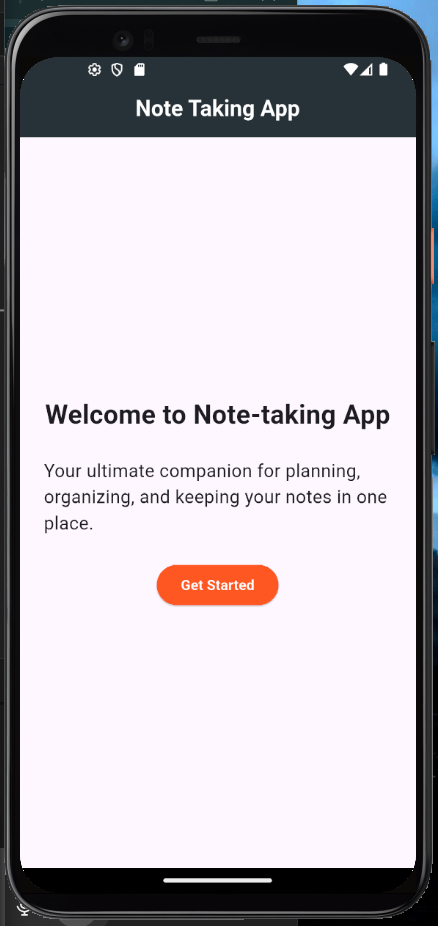
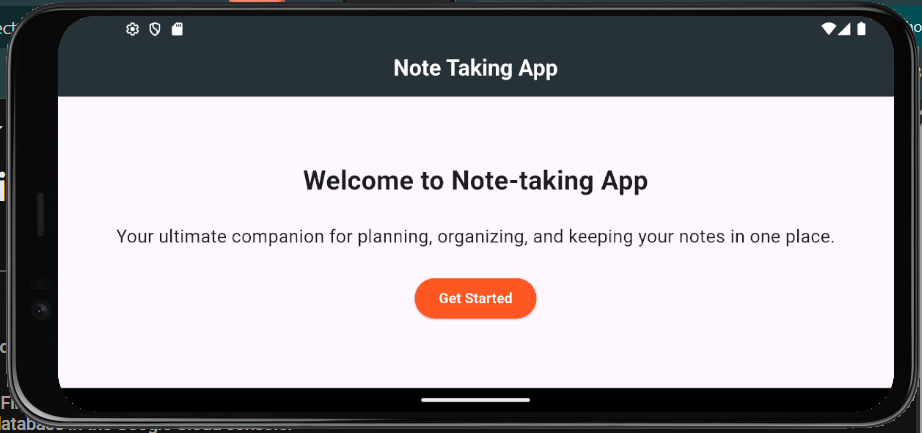
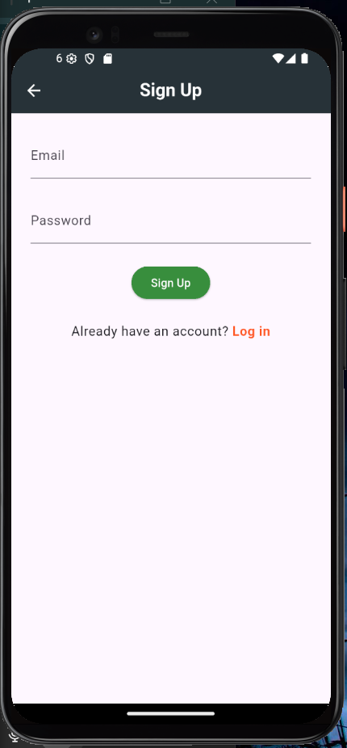
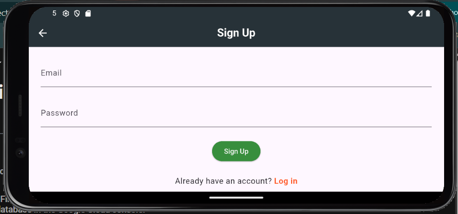
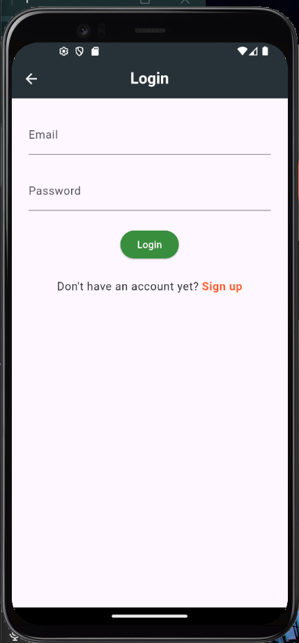
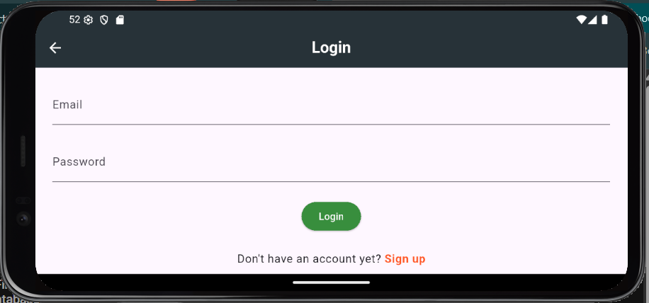
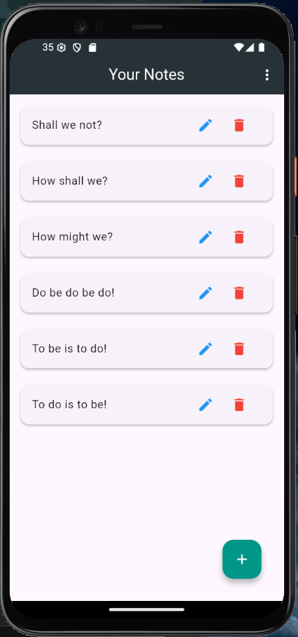
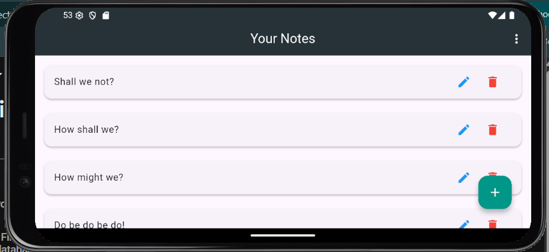

# Note Taking App (Flutter + Firebase)

A simple and intuitive note-taking app built using Flutter and Firebase. Users can securely sign up, log in, and manage their notes with automatic syncing via Firebase Firestore.

---

## Features

- User Authentication (Email + Password)
- Create, update, delete notes
- Realtime sync with Firebase Firestore
- Navigation using named routes
- Material UI with error/success Snackbars
- Responsive UI for mobile (portrait and lanscape)

---

## Project Structure

```bash
lib/
│
├── core/
|   ├── constants.dart 
|
├── data/
│   └── models/                     # Note model
|       ├── note.dart
|
│   └── services/                   # Firebase logic
│       ├── firebase_service.dart
|
├── notes
|   ├── notes_screen.dart
|
├── providers
|   ├── note_provider.dart
|
├── screens/
|   └── auth/
|       ├── login_screen.dart
|       ├── signup_screen.dart
|   └── home/
│       ├── splash_screen.dart
│   
├── utils/
│   ├── validators.dart             # Form validation   
│
└── main.dart                       # App entry point
```
---
## Build Steps

1. Clone the repository
- `git clone https://github.com/Darlington6/note-taking_app.git`
- `cd note-taking_app`

2. Install all required dependencies

`flutter pub get`

3. Firebase Setup
- Create a project in Firebase Console
- Connect your project to your Flutter app by following the steps on the console
- Enable Email/Password in Authentication → Sign-in method on Firebase
- Create a Firestore database

4. Run the App

`flutter run`
- Or use the `run` button (looks like a triangle at the top right) in the main.dart file

---

## Environment & Security

- Sensitive files like `google-services.json` are excluded from Git using `.gitignore`.

- Firebase credentials and keys are not committed to version control.

---

## Dart Analyzer

The app passes all static analysis checks:
- `dart analyze`
- Analyzing note_taking_app...
- No issues found!

---

## Architecture Diagram

```bash
+---------------+         +-------------------------+
|   UI Layer    | <-----> | FirebaseService (Auth)  |
|  (Screens)    |         | FirebaseService (CRUD)  |
+---------------+         +-------------------------+
       |
       ↓
+------------------+
|   Firestore DB   |
+------------------+
```
---

## Screenshots (Portrait vs. Landscape)

1. Splash Screen in Portrait


2. Splash Screen in Lanscape


3. Signup Screen in Portrait


4. Signup Screen in Lanscape


5. Login Screen in Portrait


6. Login Screen in Lanscape


7. Notes Screen in Portrait


8. Notes Screen in Lanscape


---

## Author

Desmond Tunyinko

---
## Licenses

© 2025 Desmond T., All rights reserved.